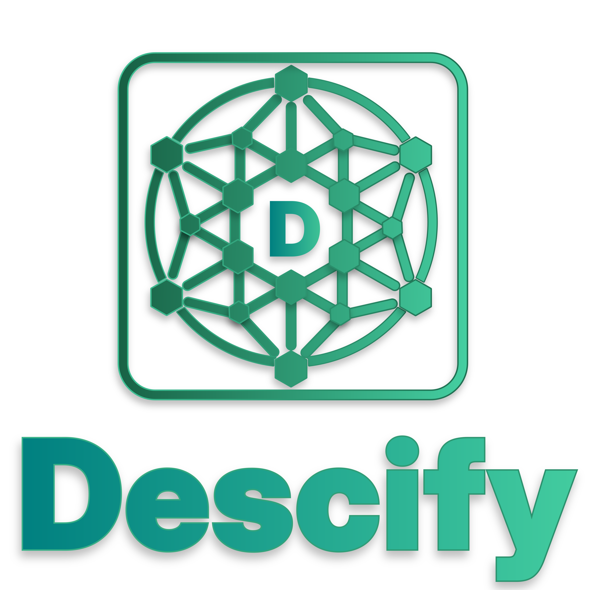

<div align="center">
  <a>
    
  </a>
</div>


# Descify - AI Title, Keyword & Description Generator

Descify is a desktop application built with Tauri, React, and TypeScript, designed to help users manage and organize image metadata efficiently.


wabhoock test 
## Features
*   **Batch:** Batch processing of images and Generate Metadata.
*   **AI Integration:** Supports Gemini and OpenRouter AI models.
*   **AI-Powered Tagging:** Integrates with AI models to automatically generate tags for images.
*   **File Preview:** Provides a preview of the images.
*   **Category Management:** Allows users to categorize images.
*   **Export Functionality:** Enables users to export image metadata.
*   **Embedding Metadata:** Embeds metadata into images Using ExifTool And It needed to have the ExifTool installed on your system.
*   **Platform Support:** Supports Windows, macOS, and Linux.
> [!WARNING]
> OpenAI isn't supported because it's "ClosedAI" and I don't have access to it.
>
 **For Gemini:** [Get API Key](https://aistudio.google.com/api-keys)
 **For OpenRouter:** [Get API Key](https://openrouter.ai/api-keys)
## Installation

1.  **Prerequisites:**
    *   Node.js and npm (or yarn/pnpm)
    *   Rust and Cargo (for building the Tauri backend)
2.  **Clone the repository:**

    ```bash
    git clone https://github.com/arrifat346afs/Descify.git
    cd Descify
    ```

3.  **Install dependencies:**

    ```bash
    bun install
    ```

4.  **Run the application:**

    ```bash
    bun run tauri dev
    ```

    This command will build and run the application in development mode.  For production builds, use `bun run tauri build`.

## Usage

1.  **Open the application.**
2.  **Open Settings:** Click the "Settings" button to configure API keys and other settings.
3.  **Import Images:** Use the "Upload" button to select images.
4.  **View and Edit Metadata:** The application will display the image and its metadata. Edit the fields as needed.
5.  **Generate Tags:** Use the "Generate" button to generate tags using AI.
6.  **Save Metadata:** Click the "Save" button to save the changes.
7.  **Export Metadata:** Use the "Export" button to export the metadata.

## Technologies Used

*   **Tauri:** For building the desktop application.
*   **React:** For the user interface.
*   **TypeScript:** For type-safe development.
*   **Vite:** For bundling and development.
*   **Rust:** For the Tauri backend.

## Contributing

Contributions are welcome! Please feel free to submit pull requests or open issues.

## Project Structure

*   `src/`: Contains the React application source code.
*   `src/app/`: Contains the application components.
*   `src-tauri/`: Contains the Tauri backend code.
*   `public/`: Contains static assets.
*   `README.md`: This file, containing project documentation.
*   `package.json`: Contains project dependencies and scripts.
*   `vite.config.ts`: Vite configuration file.

</content>
